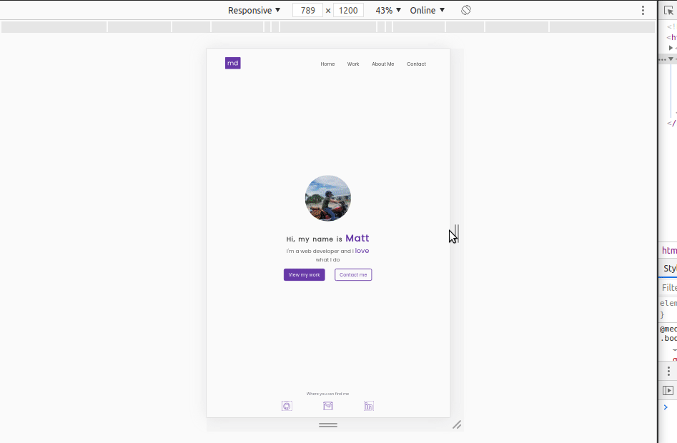

# Personal Portfolio Website

This [live website portfolio](https://mattdillemuth.com) was designed and built in order to display my work to potential clients and employers. It's purpose is to accurately convey my skill level and provide easily accessible examples of the kind of work that I am capable of.  

## Motivation

The site is a fluid project that will frequently be updated with new content. As my skill and knowledge of development grows I will be able to implement more complex features and interactivity.

## Screenshots

## Technology

This website is built with pure HTML & CSS. No frameworks or libraries were used in this project. 

## Tools Used 
- Figma
- Visual Studio Code [Live Server](https://marketplace.visualstudio.com/items?itemName=ritwickdey.LiveServer)
- Browser Testing - [Crossbrowsertesting](https://crossbrowsertesting.com/)
- W3C Validator - [Nu HTML Checker](https://validator.w3.org/)
- Accessibility Visualization Toolkit [tota11y](https://khan.github.io/tota11y/)
- [PostCSS](https://madlittlemods.github.io/postcss-css-variables/playground/)
- [Autoprefixer](http://autoprefixer.github.io/)
- Netlify (hosting & form functionality)
